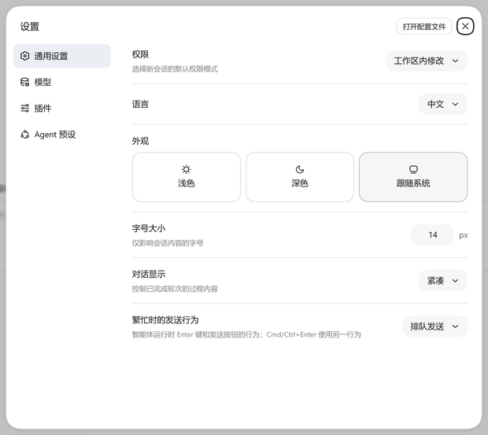
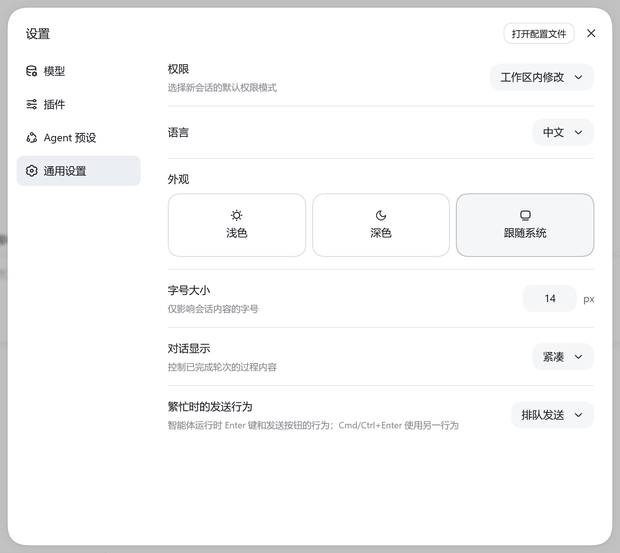

<div align="center">

# dsh-settings-nav-order

**长按拖动，重排设置面板左侧大项。**

[English](README.en.md) · **中文**

[](#安装)
[](LICENSE)


<sub>长按「通用设置」并向下拖动 —— 被拖项半透明跟随光标，松手即保存。</sub>

</div>

---

## 简介

DeepSeek Harness 的设置面板里，大项顺序由各插件自己的 `order` 决定，装得越多越难按自己的习惯排列。

本插件给导航加一个**隐藏手势**：**长按任意大项约 0.3 秒，上下拖动，松手自动保存**。下次打开设置面板仍是你的顺序。

它**不添加任何 UI** —— 不新增设置页、不注册任何插槽、不改变导航外观。装完在界面上找不到它，这是刻意设计。

| | |
|---|---|
| **拖动前** |  |
| **拖动后** |  |

## 功能

- **长按拖动排序** —— 长按 0.3 秒进入拖动态：被拖项**半透明（50%）+ 描边 + 阴影**，并实时跟随鼠标纵向移动
- **松手即存** —— 顺序写入插件自己的目录，无需点保存按钮
- **跨重启保持** —— 下次打开设置面板仍是你排的顺序
- **误触保护** —— 只响应主键；长按后位移超过 6 px 视为滚动/点击，取消拖动；拖动结束的瞬间吞掉那次 click，不会误切换设置页
- **抗重渲染** —— 用 `MutationObserver` 跟随面板重开与 React 重渲染，顺序始终被重新施加
- **无痕卸载** —— 卸载后立即恢复官方原序，并清理全部监听、观察器与样式
- **不碰共享配置** —— 不写 `settings.yaml`，不改任何外部数据

## 安装

需要 Node.js 与 `dsh`、`pnpm`：

```sh
npm install -g @deepseek-ai/dsh pnpm
```

然后安装本插件（把 `web` 换成你的 profile 名）：

```sh
dsh plugin --profile web add dsh-settings-nav-order
```

**装完需重启 `dsh`** —— 新增的 bundle 不会热应用到正在运行的进程：

```sh
dsh --profile web
```

重启后**刷新浏览器页面**，打开设置面板（侧边栏底部齿轮）即可使用。

> 从 GitHub 源码安装也可以：`dsh plugin --profile web add github:<owner>/dsh-settings-nav-order`

## 用法

1. 打开设置面板（侧边栏底部的齿轮按钮）
2. 在左侧**长按**任意一个大项约 0.3 秒
3. 该大项变为半透明并跟手，上下拖动到想要的位置
4. **松手** —— 顺序即刻保存

想恢复官方顺序，见下方「卸载」。

## 数据存放

顺序记录写在**本插件自己的目录**里：

```
<插件目录>/data/order.json
```

内容形如：

```json
{
  "version": 1,
  "order": ["general", "models", "plugins", "agent-presets", "jet-hub"]
}
```

**这是本插件的全部数据，只此一处。**

### 明确的边界

| 项目 | 行为 |
|---|---|
| `~/.dsh/settings.yaml` | **绝不写入**。不注册任何 settings 命名空间 |
| 其它插件的文件 | **绝不触碰** |
| 你现有的配置与会话 | **绝不改动** |
| 外部任何数据 | **不改** |

为什么不用官方的 `ctx.settings`（写 `settings.yaml`）？因为那是**共享配置文件**，且 DSH 设计上**卸载插件时不会清理**其中的命名空间段，会永久残留。顺序记录属于「偏好缓存」而非「配置」，放在插件自己目录里更干净：**卸载即随目录一起消失，零残留。**

## 卸载

```sh
dsh plugin --profile web remove dsh-settings-nav-order
```

卸载后会：

1. **立即恢复官方原始顺序** —— 插件的清理逻辑显式把导航 DOM 还原为官方台账
   （`ctx.slots.entries('settings.section')` 按 `order` 升序）的顺序，**不依赖** React 恰好重渲染
2. 移除全部事件监听、观察器与样式
3. `dsh plugin remove` 会把本包移出 profile 的 `dsh.profile.bundles`，它自带的装配层随之不再被加载

> 卸载后需**重启 `dsh` 并刷新浏览器页面**才能看到导航恢复。
> 若只想临时回到默认顺序而不卸载，删掉 `data/order.json` 再刷新即可。

## 原理

设置面板的导航列表**不是 Slot** —— 它由设置面板内部直接渲染。因此本插件：

1. 读取 `settings.section` 台账（`ctx.slots.entries`），按与面板完全一致的排序算法计算行序
2. 用稳定选择器定位导航列表：`[role="dialog"][aria-modal="true"] > nav > div:last-child`
3. 把 DOM 按钮与台账条目**按 label 文本配对**（全部失配且数量相等时才退化为按位置对应）
4. 长按成立后，直接 `insertBefore` 搬动 DOM，并给被拖项加 `translateY` 让它跟手
5. 用 `MutationObserver`（带风暴看门狗）跟随面板重开与重渲染，把顺序重新施加
6. 顺序通过 Host 半部的 `GET/POST /api/settings-nav-order/order` 持久化

**全部样式、订阅、观察器与监听都挂在插件 fiber 上**，停止或卸载时自动清理并还原。

**参考的社区先例**（架构同源）：

- [`dsh-settings-nav-organizer`](https://github.com/zhengjy01/dsh-settings-nav-organizer) —— 提供了导航 DOM 定位、台账读取、风暴看门狗与 fiber 清理的成熟范式
- [`@choi-p/dsh-footer-order`](https://github.com/Choi-Peng/dsh-footer-order) —— 提供了「DOM 子节点 ↔ 台账条目 id 配对」策略与「卸载不留痕迹」的验证

## 已知限制

1. **导航列表不是 Slot**，本插件靠 DOM 选择器定位。若 DSH 未来改了设置面板结构
   （`nav > div:last-child` 这层），拖动会失效 —— 此时需要更新选择器。
   失效是**静默**的（不报错，只是拖不动），升级 DSH 后建议复验一次。
2. 拖动只改变**显示顺序**，不改任何插件的 `order` 值。别家插件新增或卸载设置页时，
   未在 `order.json` 里的新项会按官方位置出现。
3. Host 路由不可用时（例如刚装完还没重启），插件退化为**仅本次会话内有效**，并在浏览器控制台给出提示。

## 排错

打开浏览器控制台（F12），本插件的日志都带 `[settings-nav-order]` 前缀：

| 日志 | 含义 |
|---|---|
| `已载入顺序记录：N 项` | 启动正常，N 为已保存项数 |
| `顺序已保存：a → b → c` | 拖动保存成功 |
| `顺序记录读取失败…` | Host 路由没通，检查是否重启了 `dsh` |
| `mutation 风暴，挂起观察器 2 秒` | 页面在剧烈重渲染，插件自我保护 |

若拖动完全没反应：

```js
// 1) 选择器能否选中导航列表
document.querySelector('[role="dialog"][aria-modal="true"] > nav > div:last-child')
// 2) 该元素下的 <button> 数量是否与设置大项数量一致
```

若点击导航没反应，检查是否有其它全屏遮罩（如新手引导弹窗）盖在上面 —— 它同样会拦截拖动。

## 兼容性

| 项目 | 要求 |
|---|---|
| DSH | 0.1.5-rc.2 上实测可用 |
| 平台 | web |
| Node.js | `^22.19.0 \|\| >=24.0.0` |
| 依赖 | 无第三方运行时依赖（仅 `react` 由宿主提供） |

## 许可证

[MIT](LICENSE)
